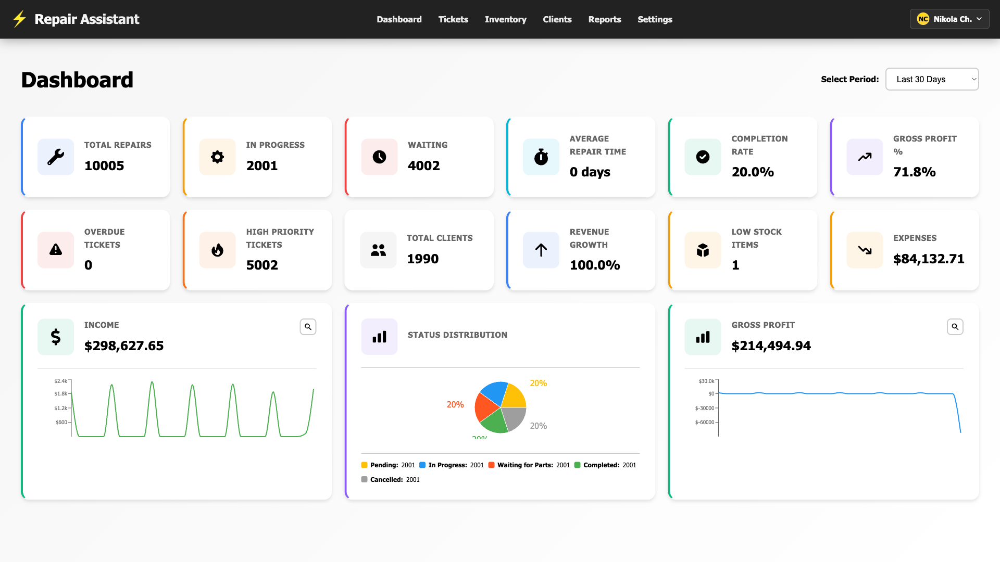
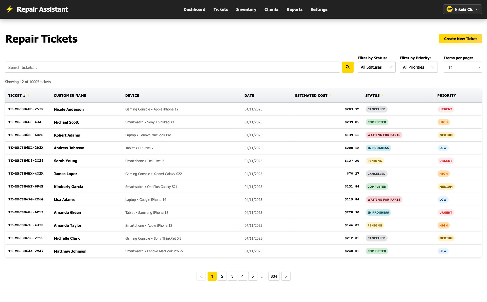
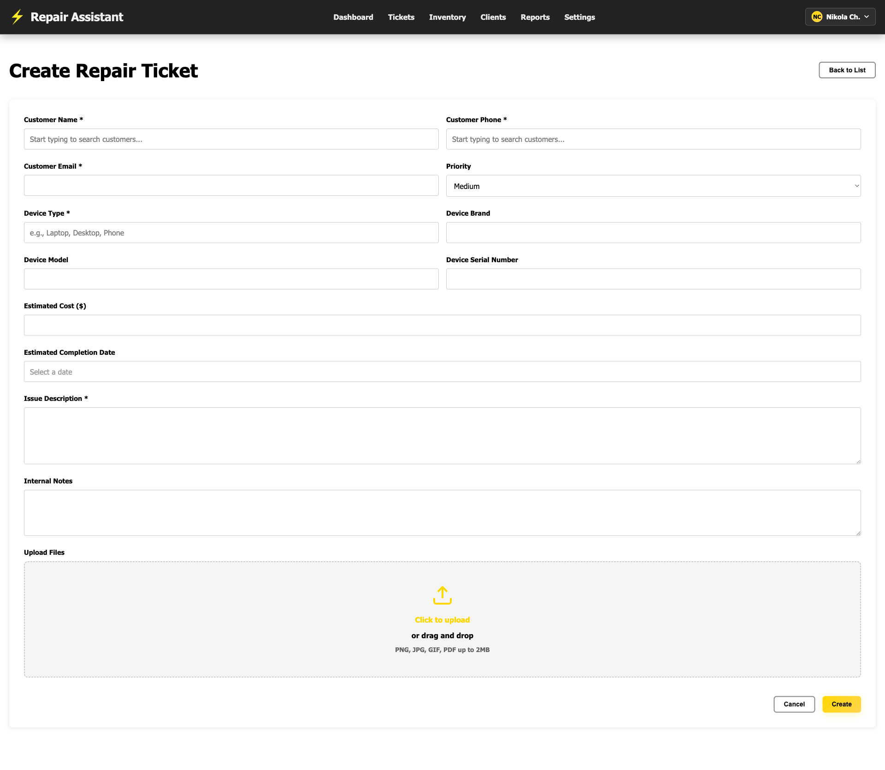
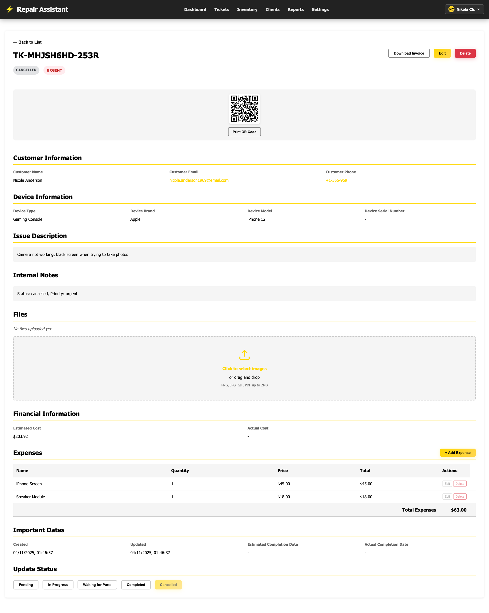
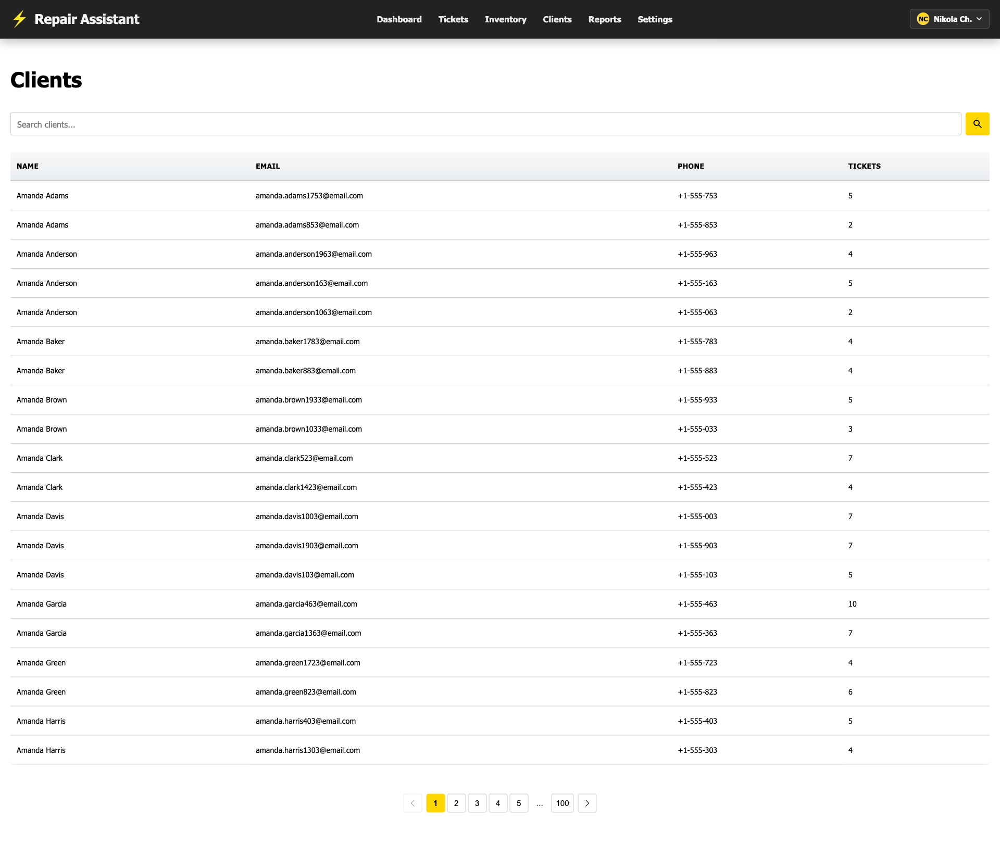
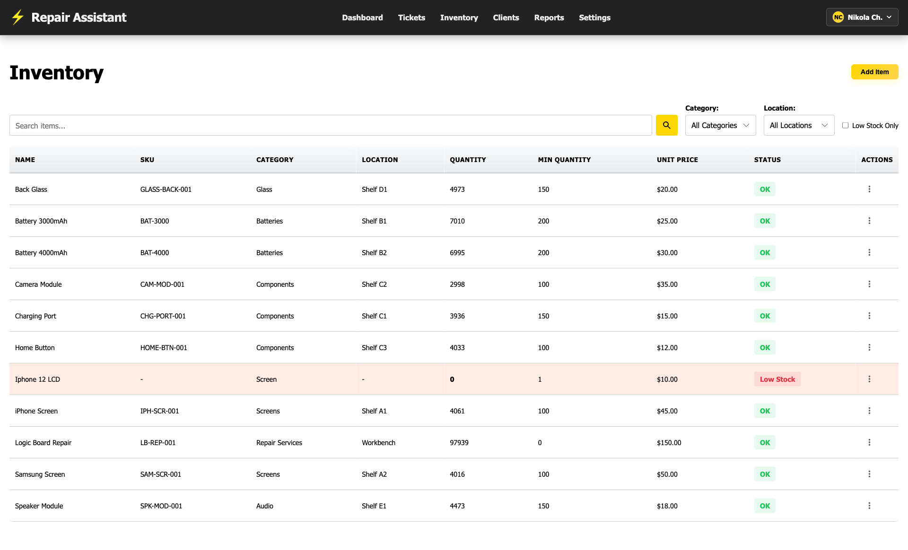
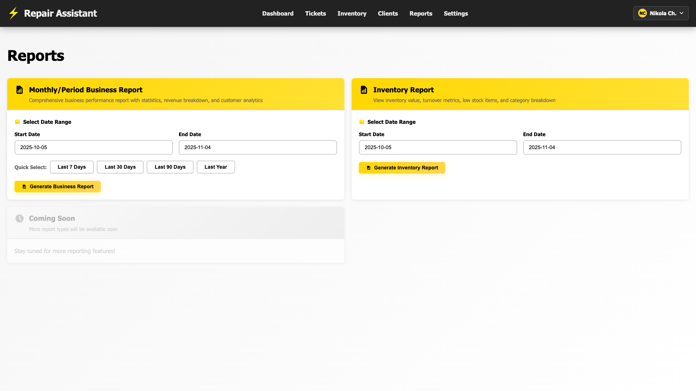
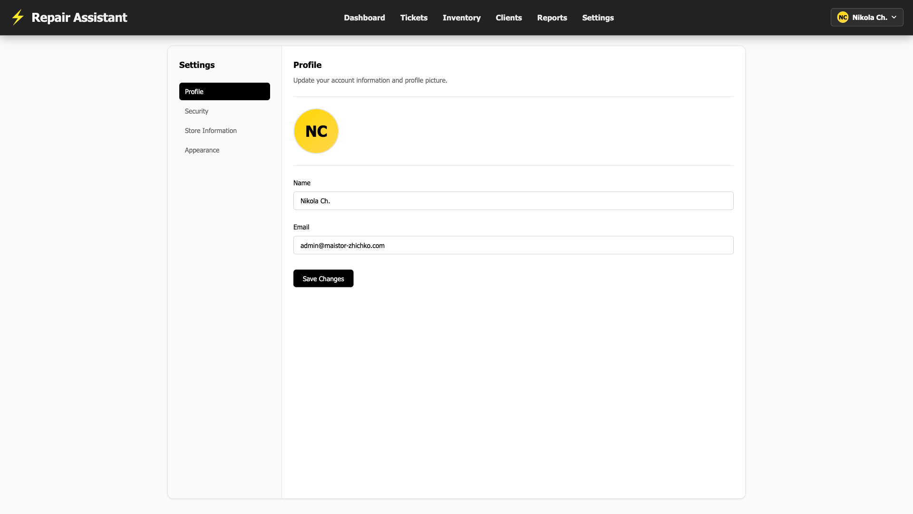

# 🔧 Repair Assistant

**A comprehensive repair management system built specifically for electronics repair businesses.**

Running an electronics repair shop involves juggling countless repair tickets, tracking device diagnostics, managing parts inventory, calculating costs, and maintaining customer relationships—all while trying to grow your business. Repair Assistant was created to eliminate the chaos of spreadsheets, sticky notes, and disconnected systems by providing a single, powerful platform designed from the ground up for electronics repair professionals.

## Why Repair Assistant?

Whether you're fixing smartphones, laptops, tablets, or gaming consoles, Repair Assistant streamlines your entire repair workflow. From the moment a customer brings in a broken device to the final invoice, everything is tracked, organized, and accessible in one place. No more lost tickets, forgotten follow-ups, or manual profit calculations. Focus on what you do best—fixing electronics—while we handle the business management.

## ✨ Key Features

### 📱 Repair Ticket Management
- Create and track repair tickets with full device details (type, brand, model)
- Status tracking: pending, in progress, waiting for parts, completed, cancelled
- Priority levels: low, medium, high, urgent
- Estimated vs. actual costs and completion dates
- Comprehensive notes and issue descriptions

### 💰 Expense & Profit Tracking
- Track parts and labor expenses per repair ticket
- Automatic profit calculations (income - expenses)
- Detailed expense breakdowns with quantities and prices
- Business intelligence dashboard with profit margins and trends

### 📸 Documentation & Images
- Upload multiple images per repair ticket (before/after photos, damage documentation)
- PDF document support for service reports and receipts
- Secure cloud storage for all attachments

### 👥 Customer Management
- Complete customer database with contact information
- Customer history: view all repairs per customer
- Quick search and filtering
- Relationship tracking for repeat customers

### 📊 Business Analytics Dashboard
- Real-time statistics: total repairs, in-progress repairs, completion rates
- Financial overview: income, expenses, gross profit, profit margins
- Trend analysis with customizable time periods (7 days, 30 days, 180 days, 1 year)
- Visual charts for income, expenses, and profit over time

### 📄 Professional Reports & Invoicing
- Generate professional PDF invoices with your store branding
- Business reports with financial summaries
- Customizable store information and logo
- VAT number support for international businesses

### 🏪 Store Customization
- Complete store profile setup (name, address, contact info, VAT)
- Custom branding: upload your logo and choose brand colors
- Multi-currency support
- Country-specific VAT handling

### 🌍 Multi-Language Support
- Currently supports English, Bulgarian, and German
- Easy to extend with additional languages
- Localized interface for international repair shops

## 🎯 Built for Electronics Repair Businesses

This isn't a generic ticketing system or a general business management tool. Every feature in Repair Assistant is tailored to the unique needs of electronics repair shops:

- **Device-Centric Design**: Track devices by type (smartphone, laptop, tablet, etc.), brand, and model—exactly what repair shops need
- **Parts Management**: Log every component used in repairs with detailed expense tracking
- **Repair Workflow**: Statuses and priorities that match real repair shop operations
- **Profit Focus**: Built-in calculations to help you understand your true profit margins
- **Customer Retention**: Easy access to repair history helps build customer relationships

## 🚀 Perfect For

- Smartphone repair shops
- Laptop and computer repair services
- Tablet and iPad repair specialists
- Gaming console repair businesses
- Electronics repair franchises
- Independent repair technicians
- Repair shops looking to go paperless

## Screenshots

The screenshots below showcase the key features and user interface of Repair Assistant:

### Dashboard
View real-time statistics, financial overview, and business analytics at a glance.

### Repair Tickets
Manage all your repair tickets with detailed tracking, status updates, and priority management.

### Create New Ticket
Quickly create new repair tickets with customer information, device details, and issue descriptions.

### Ticket Details
View comprehensive ticket information including expenses, images, notes, and generate invoices.

### Customers
Manage your customer database with search, filtering, and complete repair history.

### Inventory
Track parts and components with detailed inventory management.

### Reports
Generate professional PDF reports and invoices with customizable branding.

### Settings
Customize your store profile, branding, and application settings.

## Technology Stack

Repair Assistant is built with modern web technologies to provide a fast, reliable, and scalable solution for repair businesses of all sizes.

## License

This project is open source software, provided "as-is" without warranty of any kind, express or implied. See the LICENSE file for more details.

---

**Repair Assistant** - Streamline your repair business operations.

